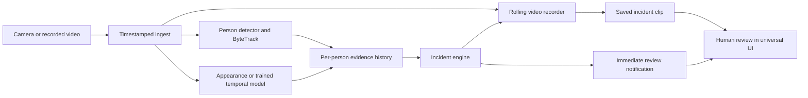

> Current implementation (2026-09-26): pretrained RF-DETR Nano person detection, server-side recorded-video jobs and cached 2D replay. Pose models and temporary IDs have been removed. See [RF-DETR implementation and measured results](rfdetr-implementation.md) and [run instructions](../../frontend/README.md). Earlier model selections below are historical; tracking, drowning assessment and incident review remain later work.

# Pool monitoring: model decision and incident workflow

Date: 2026-09-26. Scope: the user's clarified product—connect a camera/recording, detect and track swimmers, flag suspected drowning, preserve video evidence, and notify a human reviewer. This document supersedes conflicting recommendations in the earlier implementation plan. It distinguishes inspected implementation, research evidence, and proposed engineering settings. It does not claim a new model was trained or validated.

## 1. The decision

Keep the UI simple. Build one observation-to-incident pipeline; the 3D view is optional presentation and has no role in deciding whether to alert.

| Responsibility | Selected approach | Status and reason |
|---|---|---|
| Detect people | **Existing YOLOv8n COCO person detector**, initially 640 input; retain small-target tiling only where measured recall justifies its cost. | Already runs here. Freeze it for integration; there is no project evidence that switching to YOLO11/26 improves our clips. Pool-specific fine-tuning is the next detector improvement. |
| Track people | **ByteTrack, explicitly selected**, plus a persistent missing-person/incident registry. | Not implemented in the current prototype. Lightweight baseline for a fixed camera; it still cannot guarantee identity across a dive. |
| Immediate learned distress evidence | **A standard YOLOv8n two-class pool checkpoint as a separate appearance branch**, starting with the hash-audited candidate below. Keep LiB as the research comparison. | The standard checkpoint avoids LiB's custom operators, but has unverified provenance/quality and inconsistent repository documentation. It must pass load/export and independent-video checks before activation. Neither checkpoint was run here. |
| Temporal event decision | **Explicit timestamp-based evidence aggregation**, with separate appearance, lost-contact, and monitoring-health reasons. | Must be built. It turns observations into review requests, not medical diagnoses. Exact initial rules are below. |
| Target learned video classifier | **MobileNetV3-Small frame encoder + a small causal TCN per person**, trained on reviewed, source-disjoint video sequences. | Chosen development architecture, not an available pretrained drowning model. Adds learned motion/context beyond smoothing still-image scores. Requires data, training and evaluation after the integration baseline. |
| Pose | **YOLOv8n-pose optional**, disabled in the default monitoring path until it adds measurable value. | Existing overlay works for some visible upper bodies. A missing nose or wrist is not submersion evidence. |
| Video evidence/review | **FFmpeg recording/clip worker + FastAPI + SQLite incident/review records**, one shared UI. | Proposed; current server only serves a reference video/static files. |

The target remains actual suspected-drowning detection. A system that only reports disappearing boxes does **not** complete that requirement. If the appearance experiment cannot run or fails evaluation and there is no trained replacement, report the behavior branch as unavailable; do not relabel lost-contact alerts as drowning detection. The UI/recorder/tracker work can continue independently.

Do not train babies versus adults, introduce SAM/3D reconstruction into the decision, or adopt a larger model solely because it is newer. The first valuable comparison is pretrained detector versus the same architecture fine-tuned on clean pool imagery.

## 2. What our implementation actually does

Inspected: [worker](../../frontend/yolo-worker.js), [association/timing utilities](../../frontend/core.mjs), [app](../../frontend/app.js), [server](../../backend/serve.py), and [asset pins](../../frontend/setup_assets.py).

- YOLOv8n supplies person boxes; YOLOv8n-pose supplies COCO keypoints. Both are exported ONNX models, running with ONNX Runtime Web 1.22.0.
- WebGPU currently runs both models on the full image and four overlapping tiles: **ten model invocations per analyzed frame**. CPU initialization fallback uses one full image per model.
- Candidates below confidence **0.25** are discarded before display association. The tracker replacement must receive lower-score candidates as well.
- `PoseAssociator` uses greedy image-space proximity, with a maximum 0.5-second association gap and a 0.055 normalized-distance gate. Its stored tracks are replaced by current detections each update; it has no persistent lost-track bank. It is not ByteTrack and must not own incident identity.
- The 3D skeleton and planar position are schematic estimates. They do not estimate water contact, airway position, breathing, or drowning.
- The most recent browser regression snapshot recorded **17 detections, 458 ms processing, WebGPU, 0.25× playback**, with no page errors. An earlier run recorded 18 detections/490 ms. These are sampled runtime observations, not detection recall or a sustained throughput benchmark.
- A fresh detector-only diagnostic on the same local recording at 8.3 seconds measured **62.7 ms mean** for full-frame preprocessing/inference/readback (8 repetitions; 45.1–88.8 ms) and **245.5 ms mean** for five tiles (4 repetitions). This used headless Chrome/WebGPU after two warmup calls, on one repeated frame; adapter details were not exposed. It excludes NMS, tracking, behavior analysis, recording and delivery. This supports benchmarking the simpler path; it does not establish live FPS or equal swimmer recall.
- There is **no drowning-trained classifier, event engine, live-camera connector, rolling recorder, incident database, or human-review endpoint** in the current implementation.

The earlier plan's YOLO11n recommendation preceded the working YOLOv8 ONNX prototype. This decision freezes the working export rather than silently claiming the implementation uses YOLO11.

Compact checkpoint/source provenance and diagnostic timings are saved in [ml-artifact-audit.json](ml-artifact-audit.json).

## 3. What the evidence supports

| Primary source | Useful finding | Decision for this project |
|---|---|---|
| [YOLO11-LiB, Sensors 2025](https://doi.org/10.3390/s25175552) and [released code/weights](https://github.com/Mibugi/Drowning-detection) | Two image-level behavior classes; reported drowning AP50 94.1 versus baseline 91.8; 80.5 versus 189.5 FPS. Our [release audit](yolo11-lib-paper-analysis.md) documents custom operators and duplicate split leakage. | Evaluate its appearance signal; do not substitute class confidence for event probability or assume laptop/browser compatibility. |
| [Standard pool checkpoint repository](https://github.com/Taqiyyfaiz/Real-Time-Drowning-Detection-YOLOv11) | A `models/best.pt` artifact is actually present. Its metadata contradicts the repository's YOLO11 branding. | First compatibility experiment because its inspected module references are standard YOLOv8; no adoption of the repository's movement-only alarm logic or advertised performance. |
| [ByteTrack, ECCV 2022](https://arxiv.org/abs/2110.06864), [code](https://github.com/FoundationVision/ByteTrack) | Two-stage association reuses low-score boxes to reduce fragmented tracks. Published MOT results concern other datasets. | Explicit lightweight tracker baseline; evaluate swimmer identity errors locally. |
| [Nicklaser 2024 temporal drowning project](https://github.com/Z5cc/drowning-detection) | YOWOv2/ConvLSTM experiments, temporal annotations, and source reconstruction scripts. | Valuable temporal-data lead; checkpoint availability and source overlap constrain immediate use. See audit below. |
| [YOWOv2 paper](https://arxiv.org/abs/2302.06848), [official implementation](https://github.com/yjh0410/YOWOv2) | Combines spatial and temporal features; published model links cover UCF101-24/AVA. | Those action weights are not a drowning classifier. Useful comparison after a labeled video dataset exists. |
| [SwimXYZ, ACM MIG 2023](https://arxiv.org/abs/2310.04360) | Synthetic swimming data with 3.4 million frames and 2D/3D joint annotations. | Possible later pose adaptation; swimming motions do not supply drowning-event ground truth. |
| [Dronaquatics, WACV 2026](https://openaccess.thecvf.com/content/WACV2026/papers/Tran_Dronaquatics_Real-time_Swimming_Analytics_Using_Drone_Captured_Imagery_WACV_2026_paper.pdf) | Domain-adapted swimmer pose and temporal stroke analysis from drone footage. | Supports evaluating aquatic pose separately; stroke classification is not drowning classification and overhead races differ from a crowded corner camera. |
| [Multi-swimmer underwater detection, ICIAP 2025, online January 2026](https://link.springer.com/chapter/10.1007/978-3-032-10192-1_48) | Public abstract reports 69,512 underwater frames, YOLOv8n, 98.3% precision and 22 ms/frame; links a [dataset](https://doi.org/10.6084/m9.figshare.29497235). | Dataset lead for underwater cameras, not evidence of overhead-camera reliability. Only abstract/metadata inspected; full chapter was not accessible. |
| [TimeSformer+MIL, May 2026](https://sciexplor.com/jbde/articles/jbde.2026.0039) | Proposes weakly supervised temporal detection for open-water/construction scenes without person tracking. | Useful event-level evaluation ideas. Its scene-level design does not directly satisfy our per-person requirement; no downloadable checkpoint was identified on the inspected article page. |
| [NEPTUNE, 2018 preprint](https://arxiv.org/abs/1805.02530) | Short-video image-statistics/rule approach; abstract claims no false positives in its experiment. | Historical evidence for temporal analysis, not a transferable zero-false-alarm guarantee. Not selected. |
| [MYLO manufacturer explanation](https://coralmylo.com/how-it-works/) | Describes combined above/underwater cameras, motion analysis and event notifications. | Workflow reference; vendor claims are not independent benchmarks for our single-camera software. |
| [CPSC staff letter, June 2025](https://www.cpsc.gov/s3fs-public/June-5-2025-CPSC-Letter-to-ASTM-F15-49-Computer-Vision-Pool-Alarms.pdf) | Staff questions the rescue usefulness of a test requiring 20 seconds motionless on the bottom and recommends broader entry coverage. | Do not derive a supposedly safe universal timer from a standard or competitor. This is a dated staff position, not certification of our design. |

Current [Ultralytics tracking documentation](https://docs.ultralytics.com/modes/track/) supports explicitly selecting ByteTrack. Defaults and available trackers change; do not copy a teammate's claim that ByteTrack is always the default. Pin the implementation/config used in each run.

### Newly verified standard checkpoint: easier integration, unproven quality

At [commit `36e837ce042406f8e7e57afff43f56618ebffd74`](https://github.com/Taqiyyfaiz/Real-Time-Drowning-Detection-YOLOv11/tree/36e837ce042406f8e7e57afff43f56618ebffd74), `models/best.pt` is **6,257,130 bytes**, SHA-256 **`8bc030b196711e319daf819c698b8c3f5f0f91f4361e674d4b1e951e3149a4d3`**. Static ZIP/pickle-opcode inspection (no unpickling/execution) records standard `C2f`/`Detect` modules, `model=yolov8n.pt`, Ultralytics **8.4.7**, and `{0: normal, 1: drowning}`. The repository calls it YOLO11 and pins **8.3.0**; do not copy those claims/settings unquestioningly. No custom LiB operators were referenced, but ONNX export was not tested.

The checked `main.py` ignores predicted behavior classes and labels risk using pixel displacement. **Do not adopt that decision logic.** Model scores and claimed recall were not reproduced. No root license was identified; checkpoint metadata contains AGPL-3.0. Data provenance, leakage and usage terms need review before adoption. Treat this as an evaluation candidate, not a trusted pretrained safety model.

Run the standard candidate before LiB's custom environment experiment. If it fails held-out checks, reject it; do not prefer it merely because it loads. For our own first trained appearance baseline, use the same MobileNetV3-Small encoder proposed for the temporal branch, trained on reviewed person crops. Cropping avoids treating every unlabeled neighbor as detector background, but neighboring people and ambiguous still-image labels remain possible; there is no guaranteed CPU training time.

The current browser decoder expects **84 output channels (4 box + 80 COCO classes)** and reads class 0 as `person`. A standard two-class YOLO export typically has 6 channels before NMS, subject to export settings. It needs its own inspected output adapter and class map; renaming the new checkpoint to `yolov8n.onnx` would not integrate it correctly. Preserve the general person detector separately so a behavior model's missed box or changed class cannot erase a tracked swimmer.

For the first export experiment, use a disposable environment without credentials, with dependencies prepared before loading the external PyTorch artifact. Static opcode inspection is not a guarantee that unpickling is safe. Start with the checkpoint's recorded Ultralytics 8.4.7 rather than the repository's mismatched requirement; pin and record the actual successful environment. Check input dimensions, preprocessing, output shape, class mapping, ONNX opset and numerical agreement on sample images. Record the exported ONNX hash and use that artifact for runtime evaluation. Loading/export success is not the class-quality acceptance test. Artifact terms must be resolved before redistribution.

### New temporal-data audit: our demo video is included

Inspected [commit `b75850a26cc8e6b255bd09ffb26c333adce4fa2a`](https://github.com/Z5cc/drowning-detection/tree/b75850a26cc8e6b255bd09ffb26c333adce4fa2a). The manifest has **111 rows from 82 source videos**. Its [line 44](https://github.com/Z5cc/drowning-detection/blob/b75850a26cc8e6b255bd09ffb26c333adce4fa2a/dataset_lifeguard/datalist.csv#L44) contains our exact source **`PuAfTA2wf7o`, 36.63–46.85 seconds**. That proves dataset membership, not which fold trained a particular checkpoint. Keep the entire source out of training if using it for evaluation, or select a different test source.

The inspected recursive tree and GitHub releases contained no `.pt`, `.pth`, or `.onnx` checkpoint files and no releases. `test.py` expects locally saved weights. Python 3.8 is the documented tested environment. Thus this is not a verified ready-to-run pretrained drowning solution. No top-level project license was identified; upstream MIT credits do not establish all artifact/video permissions.

## 4. Detector and tracker: exact integration choice

Run the authoritative worker independently of the browser playback controls. The current ONNX export can remain the detector; move it behind a tested worker adapter when the native runtime is available. Do not assume Windows ARM supports every Python/CUDA/custom-op dependency. A compatible separate inference machine is an explicit deployment option, not a requirement already satisfied.

Initial engineering configuration, to tune on development footage:

```yaml
detector:
  model: yolov8n
  task: person
  input_size: 640
  candidate_confidence: 0.10
  nms_iou: 0.50
tracker:
  implementation: ByteTrack
  high_threshold: 0.25
  low_threshold: 0.10
  new_track_threshold: 0.35
  fuse_score: true # compare false on cached development observations
  nominal_analysis_hz: 5
  lost_track_retention_sec: 2.0
  max_continuity_gap_sec: 1.0
pose:
  enabled: false
```

These are adapter-level settings, not a claim that every ByteTrack YAML has identical field semantics. Keep both low/high detection bands; do not feed only today's confidence-0.25 display output to ByteTrack. Births need stronger evidence than continuity matches. Record detector confidence as a model score, not probability of being safe.

Use original video coordinates and one tracker per camera epoch. A new connection, discontinuous timestamp, or changed view creates a new epoch. Pool polygon membership is an approximate image-space observation; confirm membership/observed deck exit over several observations to reduce boundary flicker.

Tracker age is not the incident clock. The inspected [Ultralytics 8.3.82 tracker](https://github.com/ultralytics/ultralytics/blob/v8.3.82/ultralytics/trackers/byte_tracker.py) scales its lost buffer using `frame_rate / 30`, while its [integration](https://github.com/ultralytics/ultralytics/blob/v8.3.82/ultralytics/trackers/track.py) initializes the tracker at 30. Direct construction versus the high-level wrapper therefore affects how a frame buffer corresponds to elapsed seconds. Set the adapter deliberately, record actual processed cadence, and verify expiry with timestamped sequences. Live dropped frames also affect Kalman prediction; a large gap must invalidate motion continuity rather than pretending adjacent frames were processed.

Use an existing, tested ByteTrack implementation in a compatible worker. A new Kalman/Hungarian JavaScript port is not a prerequisite for this hackathon. Keep the current browser detector as a temporary observation producer if that is the only verified runtime; its tab lifecycle must be exposed as a monitoring limitation until monitoring runs independently. Do not claim the local Python service already executes these models.

The inspected 8.3.82 wrapper also **skips `tracker.update` on empty detection frames**. Our adapter must update once per analyzed frame, including empty results, and expire continuity using timestamps. Keep raw observations separately from the tracker's returned boxes. New tracks in this version require prompt subsequent confirmation; tracker-internal duplicate cleanup can remove hypotheses without resolving our person records. Never derive incident persistence solely from the tracker's removal callbacks. These findings concern the inspected version, not every release.

Tune NMS with annotated crowded frames: a higher IoU threshold may retain overlapping people but also more tile duplicates. Compare the current 0.50 with 0.70 on development data rather than declaring either universally correct. Confirm a person record with repeated credible observations (initially at least three hits spanning 0.6 seconds); this suppresses some spurious track births but cannot guarantee completeness. Suspicious unconfirmed detections remain eligible for an unassigned review candidate. Two strongly overlapping boxes can represent two real swimmers; overlap alone must never close a missing-person incident as a duplicate.

Maintain stable `person_record_id` / `incident_id` outside disposable `track_id`. Keep unresolved losses after tracker expiry. A nearby new detection is a possible match, not automatic proof of recovery. Never clear an incident because the total person/head count recovered; the returning person may be someone else.

## 5. How the system decides to request review

There is no reliable binary deduction from one image that establishes drowning versus safety. The implementable decision is whether a particular person's observed evidence warrants **suspected-distress review**, with separate uncertainty/visibility reasons. Human review is part of the requested product.

Keep these independent:

1. **Observation:** visible person, observed location, pose when available, appearance score, visibility/association quality.
2. **Episode:** candidate, alerted, evidence-ended, unresolved.
3. **Review:** unreviewed, acknowledged, confirmed concern, false alert, unable to assess; preserve reviewer identity/time.
4. **Health:** connected/processing/degraded/disconnected; healthy decoding does not certify visibility of every swimmer.

### A. Appearance evidence: first experiment

Use the actual checkpoint class map: the standard candidate has `0=normal, 1=drowning`; LiB has `0=Drowning, 1=Swimming`. Preserve raw class labels/scores and the model hash. Run the selected model on the same timestamped frames as the tracker, associate boxes one-to-one by overlap, and reject ambiguous person assignments. Do not require pose success. An unmatched suspicious box should create an **unassigned region candidate** for review rather than being discarded merely because COCO missed that swimmer.

Unassigned regions need continuity too: run a separate instance of the same tested tracker over the appearance model's boxes with behavior classes collapsed for association. This instance owns `appearance_track_id`; it never resolves or overwrites the person registry. Link its tracks to person tracks only when matching is unambiguous. Unlinked appearance tracks can accumulate temporal evidence and produce region incidents; a new anonymous box every frame cannot satisfy a per-region history rule. Preserve links as hypotheses and merge duplicate notifications only with established evidence continuity.

For the two-class export, deduplicate boxes across classes while retaining both original scores of each retained candidate; do not produce two tracks for a normal/drowning label flip on the same box. Validate NMS on genuinely overlapping swimmers. Read model/export dimensions rather than assuming every new artifact accepts 640. Bind thresholds and preprocessing to the checkpoint hash; 0.70 from one model is not a calibrated equivalent of 0.70 from another.

Do not interpret a missing appearance detection as score zero or normal swimming. Detector confidence is not a calibrated conditional probability of drowning. When both class scores are available, preserve them; do not invent a complementary score by subtracting from one.

Initial **experimental** policy:

- Evaluate a rolling **3-second source-time window** per person/region.
- An appearance observation is eligible only when timestamp, box and association are usable. Require at least **80% temporal coverage** of the full window.
- Mark an eligible observation suspicious when `Drowning` is its highest-scoring class and that score is at least **0.70**; tied or ambiguous class assignments remain unknown. Request review when suspicious observations cover at least **70% of eligible time** in that window and the current observation is suspicious.
- Measure duration, not frame count. Bound each observation's support to at most **0.3 seconds** at the proposed 5 Hz cadence; longer gaps remain unobserved. Use only elapsed intervals, never extrapolate evidence into future time.
- Notify at the threshold crossing; there is no extra 5/12-second waiting period. Attach `reason=appearance_persistence`, raw scores and the actual coverage.
- End the active evidence interval only after **3 seconds of adequately observed low-suspicion evidence**, with a lower reset threshold (initially 0.30). Missing data cannot reset it. The saved incident remains available for review.

These numbers define a reproducible prototype, **not validated rescue timing**. Correlated false classifications can persist for seconds; temporal smoothing is not proof that the underlying appearance model is correct. Tune thresholds against false alerts per camera-hour and event recall, then freeze them before testing.

The coverage condition is a real capability gate. At a steady 458 ms between analyzed **source** frames, a 0.3-second support cap gives only about 65.5% coverage, so this branch cannot meet the 80% requirement. The existing slowed replay has different source-time spacing from wall time and does not demonstrate live compliance. Display `appearance_unassessable` if the worker misses the declared cadence; do not silently extend sparse predictions across missing time. A different sampling contract requires new evaluation. Merge continuing triggers into the same incident rather than generating a notification each frame.

### B. Lost contact: independent reason

For a previously established in-pool person with no confirmed exit, retain last reliable timestamp/position. On healthy incoming frames, show a lost-contact warning after **3 seconds** and open a review incident after **5 seconds**. These are prototype settings, not inferred submersion or drowning durations.

Ordinary dives, people behind floats, ID switches and detector misses can all cause this alert. A convincing continued track can end the missing interval; a new ambiguous ID leaves the person record unresolved. A camera outage produces a health alert immediately and leaves prior incidents unresolved; it must not create a fictitious confirmed-submersion interval for everyone.

For automatic continuity, require same-track reactivation within timestamp-checked retention and consistent evidence; an unchanged ID alone can still hide an association error. Record uncertain links for review. Short retention deliberately trades identity-swap risk against unresolved incidents: a person returning under a new ID after 2.5 seconds may leave the old registry entry unresolved and trigger at 5 seconds. Sweep 2/3/4-second retention and score fusion on development footage, measuring both swaps and reviewer workload. Do not solve excessive alerts by silently treating the nearest new swimmer as the missing one. A person moving out of camera coverage without an observed exit remains unobserved and reviewable.

Before testing, freeze continuity gates for elapsed gap, competing matches and box-scale change. An initial development setting is a best-match IoU of at least 0.30, a margin of at least 0.15 over competing hypotheses, and box dimensions within 0.5–2× their prior values; these numbers require perspective/occlusion testing and do not establish identity by themselves. Log prediction-to-observation displacement and reject competing old/new assignments. Ending a missing interval changes an already saved incident to `evidence-ended, pending-review`; it does not dismiss it or certify that person as safe.

### C. Motion and pose: what can legitimately be measured

Motion is change across observations, not a separate capability supplied by a static YOLO box. Compute displacement in image space normalized by person scale, changes in box/upper-body orientation, and reliable joint velocities over time. Record actual time deltas and missing masks. Image-space movement is not metric swimming speed, and camera movement invalidates it.

Visible hands, splash, little translation or a vertical torso can support a learned or reviewable feature sequence; **none alone establishes distress**. Floating, treading, playing and resting create similar evidence. Water optical flow includes waves, and still water does not prove a person is still. An above-water head detector can also detect heads below clear water; absent head/nose detections are `unknown`, not `below`.

The initial system has an explicit gap for a still-visible motionless submerged person if its appearance model does not flag them. Do not claim the lost-contact rule covers that case. A dedicated above/below/unknown classifier requires separately reviewed labels and held-out testing; it is not supplied by YOLO-Pose or a crowd head detector.

### D. Chosen next learned motion model

Our proposed trainable baseline is **MobileNetV3-Small + causal temporal convolutions**, using the [official frame encoder](https://docs.pytorch.org/vision/main/models/generated/torchvision.models.mobilenet_v3_small.html) and the [TCN research/code](https://github.com/locuslab/TCN) as implementation references. Those components have no pretrained drowning knowledge. This combination is our engineering choice, not a claimed published pool benchmark.

Start with 16 per-person RGB crops at 5 Hz (approximately 3 seconds of history), padded around the box to retain local water context and resized with aspect preservation to 224×224. Feed frozen ImageNet frame embeddings, observation masks and actual time deltas into a small causal TCN; output a current suspected-distress score and abstain when coverage/identity is inadequate. Compare an encoder fine-tuned on pool appearances as a separate ablation, rather than assuming it improves motion recognition. Fit on reviewed sequences including ordinary swimming, dives, floating, splashing, occlusion and low visibility. Do not require a complete skeleton. Optional pose features are an ablation only after the RGB baseline works.

Keep windows causal, never spanning a source cut or an ambiguous identity change. Evaluate shorter contexts and early-onset delay; a 3-second window is a starting experiment, not proof that waiting is acceptable. Feed its score to the event interface above once its operating point is validated; do not stack a second arbitrary full-window delay on top. Keep the lost-contact branch independent.

## 6. Camera-to-review workflow



**Input adapters:** local MP4/WebM first; RTSP cameras via a local/backend gateway; browser webcam via explicit device permission; HLS/WebRTC only through supported adapters. A universal UI does not mean all camera protocols play directly in `<video>`, or that a YouTube URL is a camera stream. Save source configuration and reject unsupported inputs clearly.

**Authoritative monitoring:** runs in the worker independently of the UI. Closing a tab, pausing replay or seeking an old clip must not pause a live monitor or recompute its incident history. Archived video uses recorded presentation timestamps; live ingest also records a capture/receive clock mapping and discontinuities. Do not make cross-camera identities a requirement.

**Recorder:** with direct server ingest, continuously keep at least 30 seconds of compressed rolling segments per active camera. Compute the required capacity as at least the longest onset-to-trigger interval + 10-second lead-in + longest segment/keyframe interval + export margin; increase it if policy settings exceed the initial buffer. At the first candidate/warning pin evidence starting 10 seconds before candidate onset, extend through the incident, then preserve 10 seconds after the evidence ends. An unresolved long incident is stored in bounded, linked chunks with overlap; end-of-file/disconnect finalizes the available portion with `incomplete=true`. Pin existing segments before asynchronous export so buffer rotation cannot delete them.

For file jobs, export from the existing source file. For a temporary browser webcam producer, upload timestamped analyzed JPEGs/observations to a server buffer and label the resulting replay as a sampled evidence sequence until continuous video ingest is implemented. Do not present it as the original full-frame-rate recording. Retaining arbitrary later `MediaRecorder` chunks without their initialization/header data is not a reliable independently playable clip strategy; the [W3C recording specification](https://www.w3.org/TR/mediastream-recording/) does not require individual returned blobs to be playable. The full target workflow requires a tested continuous-video path, not just a seek link or a screenshot.

Send the review notification **immediately**, with snapshot, last-known box/location, reason and a provisional clip link. Do not wait for post-roll or MP4 finalization. Update the same incident as its clip becomes ready. If export fails, keep the event and report clip failure rather than losing the alert. Use stable event IDs and idempotent writes to prevent duplicate notifications after retries.

FFmpeg's [segment muxer documentation](https://ffmpeg.org/ffmpeg-formats.html#segment_002c-stream_005fsegment_002c-ssegment) explains that segment boundaries depend on keyframes. Stream-copy clips may start before the requested timestamp; save actual boundaries, or re-encode the selected clip for accurate cuts. Keep raw evidence separate from overlays. Store hashes and model/config versions with exported evidence.

**Minimal UI:** camera tile and pool outline; boxes/IDs; `visible`, `review requested`, or `unknown` with reason/timer; audio; incident list; evidence playback; reviewer disposition. Green means no current rule trigger, not certified safe. Acknowledge silences/claims a notification; it does not prove resolution. An incident dismissed as false stays in audit history.

**Data/API:** observations include `camera_id`, `camera_epoch`, `t_source_sec`, receive time, `track_id`, `person_record_id`, box, raw confidence, optional keypoints, appearance/temporal scores, coverage and missing reason. Incidents include independent ID, onset/trigger/end timestamps, reason/severity, involved identities or unknown, last observation, clip range/status, notification state and review state. Persist incidents before delivery; retry queued notifications. Start with in-app notification plus sound, with external delivery as a separately configured integration.

The current tracking-import sidecar is not this monitoring contract: it lacks raw evidence/health fields and caps history at 10,000 frames (about 33 minutes at 5 Hz). Keep long-running observations in chunked timestamped files or storage queries, with a versioned monitoring schema. Preserve the distinction between an analyzed frame with no detections and a frame that was never analyzed.

## 7. Runtime and delivery gates

1. **First two hours:** one source, saved timestamps, a source manifest, agreed observation/event schema, genuine detector output. Remove pose and 3D work from the critical path. Benchmark detector-only full frame before choosing tile count or input size.
2. **In parallel with integration:** one 60-minute checkpoint load/export gate on a compatible machine, standard YOLOv8 candidate first; then a small real-clip appearance audit. LiB is the comparison only if capacity remains. Failure means behavior recognition remains unavailable, not fabricated. Do not spend the day rebuilding custom CARAFE/browser export.
3. **Next six hours:** ByteTrack, persistent incident registry, rolling recorder, saved events and reviewer UI. Use clearly labeled synthetic observations only for event-engine tests.
4. **Next six hours:** connect genuine appearance observations if the experiment passes; measure false triggers, source age and clip delivery. Fine-tuning is conditional on an actual compatible training machine and cleaned labels. The causal video model is follow-on work, not a 24-hour promise.
5. **Remaining time:** fix failures, test multiple-source scenarios serially, freeze configuration, rehearse actual inference or explicitly labeled preprocessed replay.

Target **5 analyzed frames/second per active camera** initially, subject to measured small-swimmer recall. Live workers keep a bounded queue and prefer fresh frames over an ever-growing backlog; dropped intervals become unknown. Require a measured live operating point—for example a proposed p95 frame age below 1 second—before calling the system live. The existing 0.25× replay does not satisfy that gate. Reduce optional work, use a compatible inference host, or demonstrate offline analysis honestly.

Do not advertise four live cameras based on one sampled frame. Measure decoding, detection, tracking, behavior analysis, recorder and notification together, under realistic swimmer counts. Per-person temporal crop cost grows with crowd size; batch it and report overload explicitly rather than silently ignoring people.

## 8. Evaluation that can actually choose a model

Split by **source video, session and pool before extracting frames or windows**. Group augmented copies and near duplicates. The LiB public split has known exact duplicates; rebuild it for a meaningful detector comparison. Keep the temporal project's listed source videos, including our demo, out of a new independent test set. Public availability does not establish permission to redistribute a video; record provenance per asset.

Use the following experiment order with the same frozen test sources:

| Experiment | Question answered |
|---|---|
| Existing YOLOv8n + ByteTrack | Can we observe and retain the actual swimmers, especially small/partial ones? |
| Same detector pool-fine-tuned | Does domain data improve observation recall without unacceptable false detections? |
| Tracker + selected appearance model + frozen temporal policy | Is this an effective review-candidate generator, beyond a single image? Compare the standard candidate, any eligible LiB run, and later our own crop model. |
| Tracker + trained MobileNetV3-Small/TCN | Does learned video evidence improve event recall at the same false-alert budget? |
| Optional pose features | Do joints improve results enough to justify missing-data and runtime cost? |

Annotation units: person boxes/identity where observable; pool membership; occlusion and observed exits; suspected-distress onset/end with an uncertainty interval; independent reviewer judgment and provenance of any actual incident confirmation. Use a second reviewer/adjudication for disputed behavior labels. A rescue title alone is not frame-level ground truth; simulated distress and actual incidents must be reported separately. Never assign every person in a rescue clip the positive label.

Use a cheap trajectory-only temporal baseline as a comparison before claiming the RGB TCN adds value. Compare both on detector-generated tracks as well as any annotated trajectories; ideal manual boxes can conceal detector failures. Inspect rescue clips for label shortcuts such as editorial zooms, text overlays and lifeguard approach. The learned model must add value at the same false-review-alert budget, not merely fit those scene cues.

Re-splitting a pretrained checkpoint's original dataset does not make its new test subset unseen: the weights may already encode those examples. A clean rebuilt split is for **new training**. Evaluate existing LiB/standard checkpoints on genuinely separate sources; where training provenance cannot establish independence, label the result a development comparison rather than an independent benchmark.

Report:

- Detection precision/recall and AP, stratified by pixel size, partial visibility, glare, crowding and view.
- Tracking ID switches and fragmentation, plus IDF1/HOTA where ground-truth identities support them.
- **Event recall**, missed-event count, and **false review alerts per camera-hour** on long ordinary footage, not just rescue compilations.
- Trigger delay from annotated onset (including uncertainty), source-frame age, notification delay, and clip availability time.
- Unknown/unassessable time and degraded-camera time; do not hide these frames by dropping them from every denominator.
- Never-acquired swimmer rate: labeled in-pool people who never become registry entries, including brief entry/submersion cases filtered out by confirmation requirements.
- Duplicate incident count, correct target association, clip completeness and reviewer queue volume.

Define event matching before testing: one alert linked to the correct person/region within the predeclared onset/episode interval is one hit; repeated alerts remain duplicate workload, not extra true positives. Incorrect target attribution is an error even if someone else in the scene is distressed. Include missed detections and never-acquired swimmers in end-to-end recall, not only people the tracker happened to initialize.

For the hackathon, report raw counts and coverage rather than inventing a production target. For subsequent model selection, draw an event-recall versus false-alerts/hour curve and choose the operating point with the intended reviewer workload. Zero false alerts in ten minutes is weak evidence: under a simple Poisson assumption, zero events in H hours gives an approximate 95% upper rate of 3/H per hour. Source diversity matters in addition to hours.

Required failure scenarios include normal diving, floating/resting, splashing play, multiple simultaneous losses, one person returning while another remains missing, visible submerged body, a never-detected swimmer, track-ID change, camera cut, frozen/disconnected input, slow inference, export failure, full disk, notification retry and an incident at end-of-file. Simulation/injected detections verify plumbing and timing only, not drowning-recognition accuracy.

Cache pre-NMS candidates if comparing NMS settings; rerunning NMS on already suppressed detections does not reproduce the alternatives. For the first live feasibility gate, run the complete pipeline at original speed for at least ten minutes and report p95 source-frame age and dropped intervals. Ten minutes can establish basic runtime behavior, not a credible rare-false-alert rate.

## 9. Team allocation and what is still missing

- **Sam/Joanne:** detector/appearance audit, reviewed video data, runtime comparison, training only after the data and hardware gate.
- **Sunny:** authoritative tracking/ingest and persistent person identities, including source discontinuities.
- **Rohan:** event logic, reason taxonomy, health separation, deterministic scenario tests and evaluation policy.
- **David:** universal source UI, incident list, evidence playback, acknowledgment/disposition controls.
- Assign **one explicit integration owner** for recording/storage/API and daily interface checks; do not leave evidence export as a frontend afterthought.

Success is the complete camera → actual observations → justified review request → playable saved evidence → recorded human disposition flow. Reliable detection of every swimmer or every drowning event has not been established. This proposal addresses that goal without confusing a working animation or per-frame score with a completed monitoring system.

## 10. Claude Code review

Claude Code was invoked for **three completed review rounds** with `--model claude-opus-5-5 --effort xhigh`, read-only `Read,Glob,Grep` tools, strict MCP configuration and no session persistence. All three responses identify canonical model `claude-opus-5-5`; this was an actual CLI consultation, not a simulated second opinion. Research, artifact downloads/static inspection and browser timing checks were independently performed by Codex. Claude did not run inference or independently validate accuracy.

The architecture discussion produced these concrete decisions:

- Retain YOLOv8n for observation, make pose optional, keep low-score candidates, and use a tested ByteTrack adapter rather than writing a new tracker port.
- Update tracks on empty analyzed frames and measure retention with timestamps; registry memory must outlive track hypotheses.
- Reject automatic drowning alarms from stationarity, unconditional geometric identity merges, head-count recovery and overlap-only duplicate resolution.
- Preserve the appearance coverage gate and expose unassessable intervals. Slow offline replay is not evidence of acceptable live latency.
- Use MobileNetV3-Small for our own first appearance-training baseline and a frozen-encoder causal TCN for the first learned video comparison; neither has trained drowning weights here.
- Preserve evidence before a trigger, report immediately, and keep source recording, review status and inferred state separate.
- Evaluate pretrained checkpoints on separate sources; merely rebuilding their original split does not remove what the checkpoint already learned.

The review challenged several initial suggestions rather than accepting them wholesale: a new JavaScript tracker port, stationarity alarms, proximity-based automatic clearing, extrapolated live latency and a guaranteed sub-hour CPU training estimate were withdrawn. The resulting plan requires measured compatibility and event performance before enabling any appearance checkpoint.

The final round accepted the standard checkpoint as the **first compatibility experiment, not an accuracy endorsement**, with conditions: persistent identity for unmatched appearance regions, a correct two-class decoder, isolated checkpoint export, explicit continuity gates, and final timing/recording corrections. Those conditions are included above. This is agreement on the proposed experiment and architecture; no unimplemented condition is represented as already passing.
