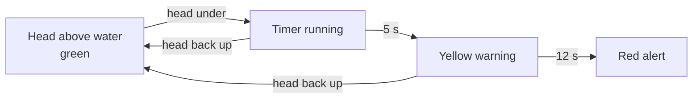
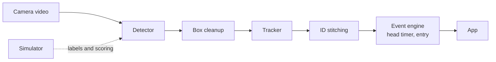

# Slide Context: 10-Slide Hackathon Deck

updated: 2026-09-26 · source of truth: [technical-story.md](../technical-story.md), [sim_results.csv](../data/sim_results.csv), [simulation.md](../../docs/global/simulation.md)

Target: about 5 minutes. Also used as the script for the presentation video.

Rules for every slide:
- Every sim number is labeled "on simulation". No real-world accuracy claims.
- Say "detects prolonged head submersion", never "detects drowning".
- Each slide: a title, at most 3 short bullets or one table or one diagram, and one visual.

Presenter split (suggestion only):

| Presenter | Slides |
|---|---|
| David (frontend) | 1, 8 |
| Rohan (event engine, Isaac Sim) | 2, 10 |
| Sunny (pipeline, tracker, simulation) | 3, 4, 7 |
| Joanne (detector) | 5 |
| Sam (pose, evaluation) | 6, 9 |

---

## Slide 1. Parents lose track for a few seconds

Presenter: David · about 25 s

On-slide:
- 62% of pool deaths of children under 5 happened when the adult lost track of the child (CPSC, 2020–2022)
- A person going under is often quiet
- Many backyards already have a camera pointed at the pool

Visual: to create: still frame from `videos/demo_hq_10s.mp4` (the pool, no overlay).

Speaker notes: Most pool accidents with young kids don't happen because nobody was home. They happen in the few seconds when the adult looked away. A lot of families already have a camera on the backyard, but it only records, it doesn't tell you anything.

---

## Slide 2. Our idea: time how long each head is under

Presenter: Rohan · about 30 s

On-slide (diagram):

Plain text: head above (green) -> head under, timer starts -> 5 s yellow -> 12 s red; head back up resets to green.

Visual: the diagram above, plus a small note on the slide: "Also flags someone entering the pool."

Speaker notes: The camera tracks every person and times how long their head has been under the water. At 5 seconds the box turns yellow, at 12 seconds it turns red and the app alerts. The industry test for pool alarms is a dummy on the bottom for 20 seconds, and CPSC says 20 seconds is too late, so we set our numbers well under that. It's a supervision aid that detects prolonged head submersion, not a certified lifesaving device.

---

## Slide 3. Pipeline

Presenter: Sunny · about 30 s

On-slide (diagram):

Plain text: video -> detector -> box cleanup -> tracker -> ID stitching -> event engine -> app, with the simulator giving labels and scoring.

Visual: the diagram above (to create: exported PNG of the Mermaid block, `images/pipeline.png`).

Speaker notes: The detector finds people in each frame, and the tracker keeps the same ID on each person over time, so each person gets their own timer. The event engine runs the timers and the entry alert, and the app draws the boxes. Everything runs locally on a MacBook, so the pool video never leaves the device.

---

## Slide 4. No drowning footage, so we built a test bench

Presenter: Sunny · about 30 s

On-slide:
- MuJoCo physics sim: pool with shallow and deep end, buoyancy added (full lungs float, empty lungs sink)
- Swim, float, dive, silent sink, collapse, fall in from the deck
- Exact boxes and head height for every frame, no hand labeling

Visual: `videos/sim_raw_baseline.mp4` (fallback still: `images/sim_pool_scene.png`).

Speaker notes: We can't film real drowning, and we shouldn't ask anyone to fake it underwater. So we built a physics sim where we script people swimming, sinking, and collapsing, and the sim tells us exactly where every person and head is. We train on 4 scenarios and test on a 5th the models never see, where a diver goes under for about 5 seconds and comes up 2 meters away. Rohan also built a second version in Isaac Sim with more realistic people and water.

---

## Slide 5. Stock models: YOLO barely sees our people

Presenter: Joanne · about 30 s

On-slide (table, held-out scenario, on simulation):

| Stock model | People found | Found when fully under |
|---|---|---|
| YOLO11n | 25% | 2% |
| YOLOv8n | 12% | 31% |
| RF-DETR Nano | 79% | 60% |

Visual: to create: bar chart of "people found" per stock model from `data/sim_results.csv` (`charts/stock_detectors.png`).

Speaker notes: We tried two YOLO models, Grounding DINO, and RF-DETR, all out of the box. YOLO is a CNN trained on COCO photos: it guesses boxes everywhere and filters duplicates after. RF-DETR is a transformer with a DINOv2 backbone that learned general shapes from a much wider set of images, and each of its 300 queries claims at most one object. That's our best explanation for why it found 79% of people with no training on our data, while YOLO found 25% at most.

---

## Slide 6. Fine-tuning on sim frames

Presenter: Sam · about 30 s

On-slide (table, RF-DETR Nano, on simulation):

| Setup | Test video | People found | Found when fully under |
|---|---|---|---|
| Stock | held-out scenario | 79% | 60% |
| Fine-tuned, 1 epoch | held-out scenario | 100% | 100% |
| Stock | new higher-quality render | 76% | 34% |
| Fine-tuned | new higher-quality render | 93% | 71% |

Visual: `videos/after_finetuned_rfdetr_edge_logic.mp4` (short clip), or to create: `charts/finetune_drop.png`.

Speaker notes: We fine-tuned on 180 sim frames. One epoch, about 2 minutes on a MacBook, took RF-DETR to 100% on the scenario it never saw, including people fully under water. But on a new sim render with textures and body shapes it never saw, it dropped to 93%, and 71% for people fully under. Even a small visual change costs accuracy, which is why real footage is our next step.

---

## Slide 7. A good detector still broke the IDs

Presenter: Sunny · about 30 s

On-slide (table, held-out scenario, 4 people, on simulation):

| Setup | IDs on screen | ID switches |
|---|---|---|
| Stock RF-DETR + default tracker | 18 | 3 |
| Stock RF-DETR + our tracking rules | 5 | 1 |
| Fine-tuned RF-DETR + our tracking rules | 4 | 0 |

Visual: `images/before_after_tracking.png` (or play `videos/before_stock_rfdetr_default_tracker.mp4` then `videos/after_finetuned_rfdetr_edge_logic.mp4`).

Speaker notes: With the default tracker we got 18 IDs for 4 people, and a timer is useless if a person keeps getting a new ID. We added rules: remove duplicate and part boxes, only start an ID after 3 frames, and give a person their old ID back if they reappear nearby within 5 seconds. That got us to 4 IDs for 4 people with zero switches across all 5 scenarios. We also saw that in clear water the body stays visible under the surface, so the alarm has to time the head, not wait for the box to disappear.

---

## Slide 8. Demo (PLACEHOLDER)

Presenter: David · about 35 s

Status: PLACEHOLDER. The frontend is not finished. Replace this slide with the screen recording once it is ready. If it is not ready, use the fallback below.

What the demo will show:
- 4 camera feeds, then "Enable monitoring" with the activation animation
- Green, yellow, and red boxes with a timer and a reason (e.g. "head not above water 3.1 s")
- Alert panel, then incident replay of the event

Visual: to create: frontend screen recording (`videos/frontend_demo.mp4`). Fallback: `videos/after_finetuned_rfdetr_edge_logic.mp4` (sim tracking, 4 IDs for 4 people).

Check before recording: the current frontend colors come from a scripted demo (`stageFor()` in `frontend/app.js`), and the head timer in the event engine is not connected yet. If the boxes in the recording are scripted, the slide must say "scripted demo". Demo thresholds must carry a "DEMO THRESHOLDS" badge.

Speaker notes (full demo): Here are four feeds. When we turn on monitoring, every person gets a box. When someone's head stays under, their box turns yellow with a timer, then red, and the alert panel lets the parent replay what happened.

Speaker notes (fallback): The app isn't ready to show, so here is the tracking running on our sim. Each person keeps one ID the whole time, including the diver who goes under and comes up somewhere else, which is what the timer needs.

---

## Slide 9. Limits, and mistakes we caught

Presenter: Sam · about 30 s

On-slide:
- All numbers are on simulation: simple bodies, flat water, no splash or glare
- Caught 2 bugs that made scores look too good (water not drawn in some renders, color-swapped test images), then re-measured everything
- Daylight only, one "person" class, no child vs adult yet

Visual: to create: side-by-side still of a render with and without water (from the bug), or reuse `images/sim_pool_scene.png`.

Speaker notes: None of this is real-world accuracy yet. Our first YOLO scores were way too good, and it turned out the water wasn't drawn in some renders. Later a second script disagreed with the first and we found we were feeding the models color-swapped images, so we fixed it and re-measured every number on these slides.

---

## Slide 10. Next steps

Presenter: Rohan · about 25 s

On-slide:
- Record real pool footage, label heads above or below water
- Fine-tune RF-DETR the same way, test only on real clips
- Connect the head timer and alerts to the app

Safety line (on slide, always): A supervision aid that detects prolonged head submersion. It does not replace watching children, pool fences, or lifeguards.

Visual: `videos/demo_hq_10s.mp4` (muted loop behind the text) or team names.

Speaker notes: Next we record real footage, label whether each head is above or below the water, and fine-tune the same way, testing only on real clips. Then we connect the head timer so the boxes turn yellow and red on their own. This is a second set of eyes for the parent, not a replacement for watching. Thanks.

---

## Timing

| Slides | Time |
|---|---|
| 1–4 | about 1 min 55 s |
| 5–7 | about 1 min 30 s |
| 8–10 | about 1 min 30 s |
| Total | about 5 min |

## Assets still to create

1. `charts/stock_detectors.png`: bar chart of people found per stock model, from `data/sim_results.csv` (slide 5).
2. `charts/finetune_drop.png`: held-out vs higher-quality render, stock vs fine-tuned (slide 6). Add the HQ numbers to `data/sim_results.csv` first.
3. `images/pipeline.png` and a head timer diagram image, exported from the Mermaid blocks (slides 2 and 3).
4. `videos/frontend_demo.mp4`: frontend screen recording (slide 8).
5. Title still from `videos/demo_hq_10s.mp4` (slide 1), and an optional "water not drawn" still (slide 9).
