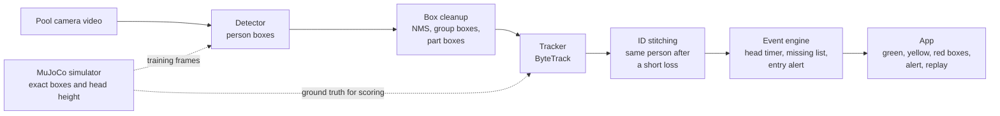

# Technical Story

updated: 2026-09-26 · for the presentation. Numbers are from our MuJoCo simulation only (see [simulation.md](../docs/global/simulation.md)); real-footage results come after recording.

## 1. The question

Can a normal backyard camera tell when someone in a pool has been under the water too long?

Two things have to work:
1. **Find every person in every frame**, including someone lying under the water.
2. **Keep the same ID on each person over time**, so a timer can run per person.

We had no real drowning footage, so we built a simulator that gives exact answers and used it to test every choice before tomorrow's real recording.

## 2. Pipeline



Plain-text version for slides:
```
video -> detector -> box cleanup -> tracker -> ID stitching -> event engine -> app
            ^                           ^
            |  training frames          |  scoring
         MuJoCo simulator (exact boxes, head above or below water)
```

## 3. The test bench: a physics simulator

- **MuJoCo** (Google DeepMind's physics engine) with a 40 kg humanoid in a pool with a 0.9 m shallow end and a 2 m deep end.
- MuJoCo has no buoyancy, so we added it: body tissue slightly denser than water, plus lift from air in the lungs. Full lungs float, empty lungs sink.
- Scripted motions: swim, float, stand, the instinctive drowning response (arms pressing down at the surface), silent sink, collapse, ducking under on purpose, diving and coming up elsewhere, and falling in from the deck.
- **5 test scenarios**, 6 to 10 s each, 3 to 5 people.
- **Free labels:** a second render tags every pixel with its body part, so each person's exact box comes out automatically. No hand labeling.
- **Honest split:** we train on 4 scenarios and test on the 5th (`resurface`: a diver goes under for about 5 s and comes up 2 m away), which the models never see.

## 4. Models we tried

| Model | Type | Pretrained on | Role |
|---|---|---|---|
| YOLOv8n | CNN, one-stage | COCO photos | Baseline |
| YOLO11n | CNN, one-stage | COCO photos | Baseline, then fine-tuned on sim |
| Grounding DINO tiny | Transformer, text-prompted ("person, mannequin, humanoid robot") | Large image-text data | Zero-shot check, offline labeling idea |
| RF-DETR Nano | Transformer (DETR family) | COCO, with a DINOv2 backbone | Baseline, then fine-tuned on sim |

All run **locally** on a MacBook (Apple GPU). No cloud.

## 5. YOLO vs RF-DETR: how they are built

**YOLO (v8n, 11n): a convolutional network that guesses everywhere, then filters.**
- Backbone: stacked convolution blocks (C2f in v8, C3k2 plus a small attention block in 11) that turn the image into feature maps.
- Neck: combines features at 3 scales so small and large people are both visible.
- Head: every cell of every feature map predicts a box and a score. That is thousands of candidate boxes per image.
- **Non-maximum suppression (NMS)** then deletes overlapping duplicates.
- Small and fast: about 2.6 M parameters for YOLO11n, 3.2 M for YOLOv8n.

**RF-DETR (Nano): a transformer that asks a fixed set of questions.**
- Backbone: **DINOv2**, a vision transformer pretrained without labels on a huge, varied image collection. It learns general shapes, not just COCO's photo style.
- Decoder: a transformer with **300 learned "object queries"**. Each query looks over the image (deformable attention) and claims at most one object.
- Trained with **one-to-one matching** (Hungarian matching): each real person is assigned to exactly one query, so the model learns not to predict the same person twice. No NMS in the design.
- Nano settings: 384 px input, 2 decoder layers, about 30 M parameters (bigger than YOLO11n, still real time on our MacBook).
- License: Apache 2.0, free for commercial use. Ultralytics YOLO is AGPL-3.0.

**What this meant for us.**
- The DINOv2 backbone is the likely reason stock RF-DETR recognized our capsule people far better than stock YOLO (below). YOLO only knows COCO photos; DINOv2 learned more general shape features. This is our explanation, not something we measured directly.
- "No NMS by design" did not fully hold on our unusual images: RF-DETR still sometimes boxed one person twice, so we added our own cleanup step.

## 6. What we found

Held-out `resurface` scenario, 4 people:

| Setup | Precision | Recall | Found when fully under | IDs on screen | ID switches |
|---|---|---|---|---|---|
| YOLOv8n, stock | 0.94 | 0.12 | 0.31 | | |
| YOLO11n, stock | 1.00 | 0.25 | 0.02 | | |
| Grounding DINO, stock (every 5th frame) | 0.52 | 0.72 | 0.89 | | |
| RF-DETR-N, stock + default tracker | 0.81 | 0.79 | 0.60 | **18** | 3 |
| RF-DETR-N, stock + our edge logic | 0.86 | 0.79 | 0.60 | 5 | 1 |
| YOLO11n, fine-tuned on sim + tracker | 1.00 | 1.00 | 1.00 | 4 | 0 |
| **RF-DETR-N, fine-tuned on sim + edge logic** | **1.00** | **1.00** | **1.00** | **4** | **0** |

(Precision: share of boxes that were real people. Recall: share of people found.)

Across all 5 scenarios, fine-tuned RF-DETR-N with edge logic shows exactly one ID per person and zero ID switches.

Key findings:
1. **Stock YOLO barely sees our sim people** (12 to 25%) and almost never someone under water.
2. **Stock RF-DETR sees 79%** with no training on our data.
3. **Fine-tuning fixes detection:** both models reach 100% on the unseen scenario, including fully submerged people.
4. **Detection is not enough.** With a good detector and the default tracker, IDs still broke (18 IDs for 4 people). The tracker and its rules matter as much as the model.
5. **In clear water the body stays visible under water.** The detector keeps boxing a submerged person, so "the box disappeared" can never be the alarm. The alarm must time how long the **head** has been under.

## 7. Fine-tuning: what we did

| | YOLO11n | RF-DETR-N |
|---|---|---|
| Start from | COCO-pretrained `yolo11n.pt` | COCO-pretrained RF-DETR Nano |
| Data | 180 sim frames (every 5th frame of 4 scenarios), boxes from the simulator | same |
| Test | 60 frames of the unseen `resurface` scenario | same |
| Training | 30 epochs, 960 px, batch 8, about 7 min | 1 epoch was enough (P 1.0, R 1.0 on the unseen scenario), about 2 min |
| Result on unseen scenario | P 1.00, R 1.00 | P 1.00, R 1.00 |

Effect: recall on fully submerged people went from 2% (YOLO11n) and 60% (RF-DETR) to 100% for both.

What it does **not** mean: the models learned our capsule bodies. They are not expected to work on real people. The same recipe (pretrained model + our labeled frames + split by recording session) is what we apply to real footage next.

## 8. Tracking: making IDs stick

Default ByteTrack on stock RF-DETR showed 18 IDs for 4 people. Three causes: flickering detections restart IDs, head-only boxes get their own ID, and one box sometimes covers two overlapping people.

Our edge logic:
1. **Box cleanup:** remove duplicate boxes of one person (NMS), remove one box around two people, remove small part boxes inside a person.
2. **Tracker settings:** an ID starts only after 3 frames in a row; a lost person is remembered for 5 s.
3. **ID stitching:** a new track that appears near where someone was lost, within 5 s, gets their old ID back.
4. **Hold:** a lost person's last box stays on screen for 1 s as "missing".

Result: 18 IDs → 4 for 4 people, zero switches across all scenarios.

One mistake we caught: our first cleanup rule deleted one of two people standing close together (recall dropped to 74% in the `crossing` scenario). Splitting it into three separate rules fixed it.

## 9. Decisions and why

| Decision | Why |
|---|---|
| Build a simulator before real footage | Exact labels for free, and cases we cannot film safely (silent sink, collapse) |
| One `person` class, no baby vs adult yet | Same alarm rule for everyone; age needs consented child footage |
| Time the head, not the missing box | Clear water keeps submerged bodies visible (measured above) |
| Split train and test by scenario | Frames from the same clip in both sets would inflate scores |
| RF-DETR over YOLO going forward | Better zero-shot on unfamiliar images, Apache 2.0 license, 1 epoch to fine-tune |
| Our own tracking rules on top of ByteTrack | Default tracker broke IDs even with a perfect detector |
| Run locally | Privacy: pool video stays on the device |

## 10. Mistakes we caught along the way

Worth one slide, because it shows how we checked our own numbers:
1. The water was not drawn in one batch of renders, so the first YOLO numbers were far too good. Fixed and re-measured.
2. Our test script fed the models color-swapped images. Found when a second script disagreed; fixed and re-measured every number.
3. The first "head under water" label was too strict and marked swimmers as submerged. Fixed from the stored head heights.

## 11. Limits and next step

- All numbers above are on simulation. Capsule bodies, flat water, no splash or glare.
- Next: record real footage, label it (boxes plus head above or below water), fine-tune RF-DETR-N the same way, and test only on real clips.
- Then connect the head timer and alerts, so a person turns yellow and then red when their head stays under too long.
